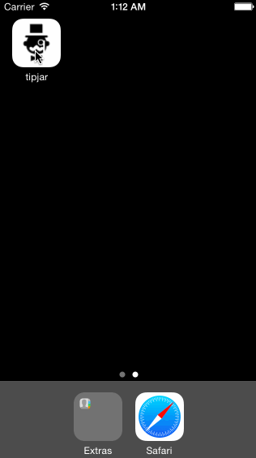

TIPS
====

This is a simple tip calculator made with Xcode and Swift, based on a tutorial by Tim Lee at Codepath. 

Required: Users can easily calculate a tip by entering their tab amount and selecting a tip percentage.  (Time: 1hr)

Optional: app icon, bg image, fonts, colors, textfield placeholder, additional feature experimentation (Time: 3 hr)

App Demo: 

Thanks for the visit :)
